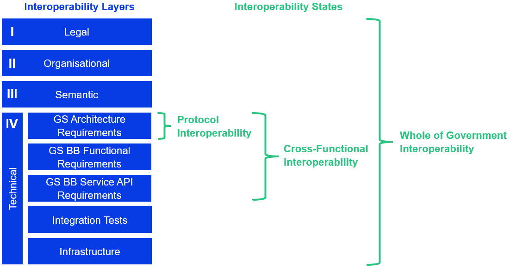

# 4.1 GovStack Interoperability

GovStack primarily focuses on the technical interoperability of digital government architecture. A useful article covering this further is available at [https://govstack.global/news/achieving-technical-interoperability-in-government-systems-from-protocol-to-whole-of-government/](https://govstack.global/news/achieving-technical-interoperability-in-government-systems-from-protocol-to-whole-of-government/) - but it is summarized here for GovStack interoperability architecture context.

> GovStack’s Building Block Specification provide a blueprint for various aspects of technical interoperability. Governments should take all interoperability layers into account from the beginning (organisational, legal, semantic, technical). GovStack calls this state “Whole of Government interoperability” and aims to create guiding documents (e.g. GovStack's Governance Architecture Guide) in addition to the technical specifications.

#### **4.1.1 Maturity States of Technical Interoperability**

<figure><figcaption></figcaption></figure>

Interoperability is not binary. Different systems within the same government will sit at different points on the spectrum. GovStack defines three cumulative maturity states that help governments assess where they are and what is needed to reach the next level.

**State 1: Protocol Interoperability**

Systems follow the same technical rules for data exchange: transport protocols (HTTPS with TLS 1.3), data formats (JSON over REST), character encoding (UTF-8), timestamps (ISO 8601 in UTC), API versioning and authentication patterns. They can exchange data without custom adaptors.

At this level, API endpoints and their meaning remain software-specific. Two systems can talk, but every new integration still requires a bilateral agreement on what data is exchanged and how. GovStack cross-functional requirements (govstack-cfr) target this state.

This is necessary but not sufficient - it does not yet enable component-level replaceability.

**State 2: Cross-Functional Interoperability**

Systems also follow the same Building Block service API contracts: the same endpoints, request parameters, response schema and error codes per functional domain.

The practical test is replaceability: one Building Block software can be swapped for another compliant implementation without changing the consuming system's code. The data behind the API may differ - a different population registry will contain different citizens - but the contract is the same.

GovStack Building Block specifications (govstack-bb-\*) target this state. This is where competitive procurement, compliance testing and software marketplaces like GovMarket operate. It does not yet guarantee semantically consistent results across institutions, because data governance and institutional agreements are not yet in place.

**State 3: Whole-of-Government Interoperability**

Protocol and cross-functional interoperability are complemented by binding organizational, legal and semantic standards across all participating institutions. A developer calling any compliant Building Block can expect not only a structurally correct response but a semantically consistent one - because data-sharing agreements, common data models and governance structures are in place.

This is the target state. It enables life-event services where a birth registration triggers coordinated updates across health, social protection and civil registry systems without manual intervention. Reaching it requires binding data exchange agreements, published semantic standards, a national service catalogue and governance bodies with authority to maintain the framework. GovStack's PAERA provides methodological guidance for the organizational and legal layers needed here.

#### **4.1.2 Dependencies Between States**

The three states are cumulative. You cannot standardize service API contracts if the underlying transport and encoding are not aligned. You cannot achieve semantic consistency if the service contracts themselves are inconsistent.

However, work on organizational agreements, legal frameworks and semantic standards should start in parallel with technical standardization - not after it. The governance and legal layers often take longer to establish and waiting for technical maturity before addressing them delays the overall outcome.

#### **4.1.3 Where GovStack Specifications Sit**

* **Protocol Interoperability** - addressed by GovStack cross-functional requirements (govstack-cfr): transport security, data formats, API design, deployment, observability and security baselines.
* **Cross-Functional Interoperability** - addressed by GovStack Building Block specifications (govstack-bb-\*): service API contracts, functional requirements and data structures per reusable component.
* **Whole-of-Government Interoperability** - addressed by GovStack's PAERA: government architecture, organizational coordination, legal frameworks and semantic alignment. Governments must build the governance, legal and semantic layers themselves.

Understanding which state a system has reached - and what blocks the next step - turns interoperability from a vague aspiration into a measurable position that can drive investment planning, procurement requirements and vendor communication.
