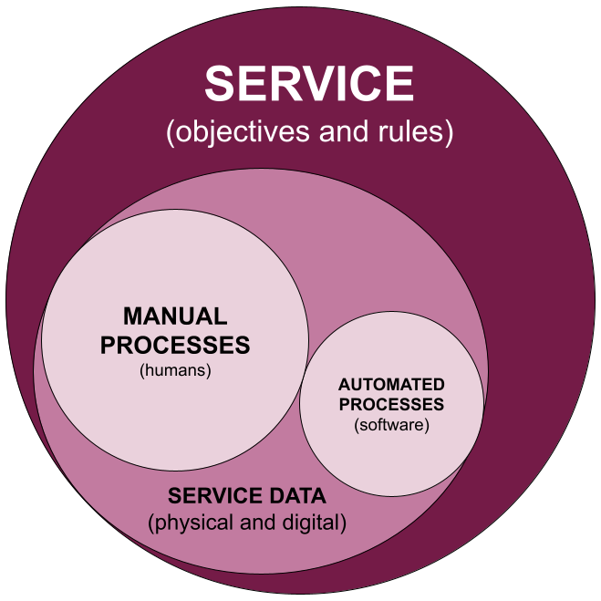
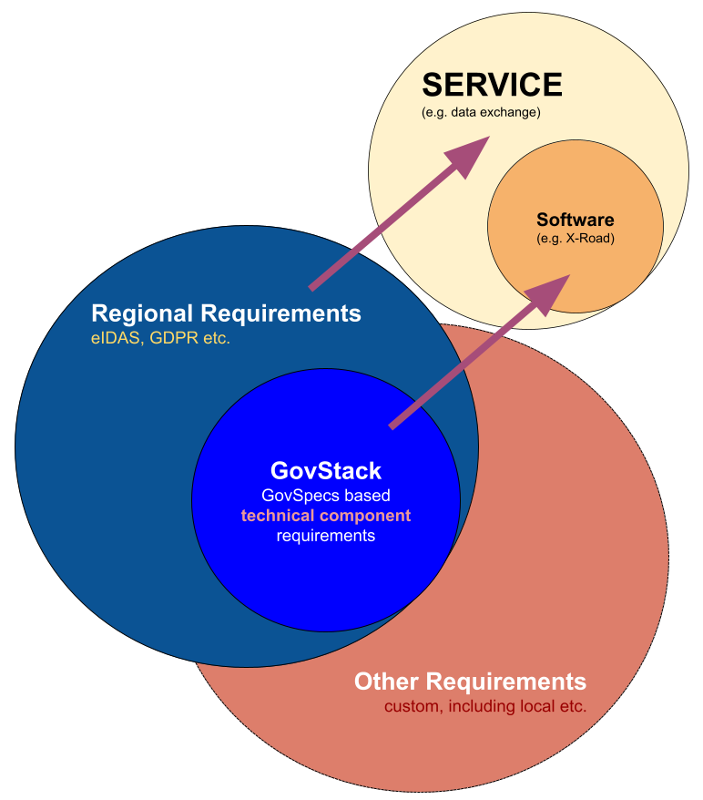

# 5.1 Specification Scope

#### 5.1.1 Specification Categories

While each specification can be mostly autonomous, strategically they are categorized into the following layers:

* **Cross-Functional Requirement specification**, formerly called cross-cutting, capture principles and rules that govern every specification in the portfolio of GovStack. They cover areas such as security, accessibility, versioning, and compliance processes, ensuring that no building block drifts from the common baseline.&#x20;

> Every other specification is expected to be an extension of Cross-functional requirements. This is the specification you are reading now.

* **Foundational Building Block specifications** serve as universal dependencies for the rest of the digital government ecosystem. Digital identity, the Information Mediator for data exchange, Workflow orchestration are in this category, because almost every other component relies on them to authenticate users, move data, coordinate steps, or store authoritative records. _Registry is also considered a foundational specification, albeit for different reasons: it is foundational as a lot of services would depend on registry building block specification based solutions._&#x20;
* **Feature Building Block specifications** provide stand-alone functions - payments, messaging gateways, geospatial services, document generation, and similar modules - that improve the stack without being prerequisites for all others. They integrate through the foundational layer but remain replaceable or optional, letting countries choose what fits their context without breaking overall interoperability.

_Categories themselves play no role in the specification development and primarily affect the governance aspects in GovStack as a whole. You do not need to define a category for your specification._

#### 5.1.2 Specification Scope is Technical

GovStack specifications are technical specifications for software components - so called GovStack building blocks. Building Blocks are software modules that can be deployed and combined in a standardized manner. Each building block is capable of working independently, but they can be combined to do much more. The scope of a specification is expected to be a specification for such software modules. Building Block’s role is the Software part of the larger business service (primarily tackling the automation of routines and processes within the business service). And both rely upon service data to function, as shown below:

<figure><figcaption></figcaption></figure>

To avoid conflicts of specifications growing out of scope it is important to keep focus on the technical requirements of the specification. As such it is fundamental to understand the clear distinction between a service and a software component. Specifications are not meant to be government service specifications, but specifications for technical software components that can be used (in part or in whole) to provide government services.

<figure><figcaption></figcaption></figure>

GovStack specifications must be designed so that digital services can meet important regional regulations, such as eIDAS and GDPR. Simply using GovStack specifications does not automatically make a service fully compliant with all laws and regulations, because legal compliance involves much more than just the technical side. Many other factors outside of the software itself, like business processes and organizational practices, also play a role.

However, it is important that GovStack specifications do not create any barriers that would make it impossible for a service to follow these regulations. In other words, GovStack should not introduce requirements or limitations that block legal or regulatory compliance. Instead, GovStack should ensure that its technical standards are flexible and supportive enough so that organizations can build services that meet all necessary regional laws and requirements when needed.

> While the scope of GovStack specifications are purely technical, legal aspects of GovStack specifications can still be covered in GovStack developments in the form of "Guides", such as eIDAS implementation guide. These are optional guides that can be onboarded for GovStack country implementation projects and can be developed or enriched as part of development of a GovStack specification.

#### 5.1.3 Specifications Are Vendor-Neutral

As defined also in the Principles, GovStack specifications are designed to be vendor-neutral. They do not favor any specific product, provider, or technology stack. The goal is to define open, clear, and implementation-agnostic technical specifications that allow for interoperability, reusability, and flexibility across different contexts and countries.

**However, being vendor-neutral does not mean excluding vendors. Experts from technology providers and vendors are encouraged to actively participate in the specification process. Their technical knowledge, implementation experience, and practical insight are essential to ensuring that specifications are grounded, usable, and aligned with real-world needs.**

At the same time, the development and governance of specifications must be led as a community effort. No vendor or stakeholder should dominate or steer the direction of a specification. The goal is to have a plurality of implementations for each specification - open source, proprietary, and hybrid - to ensure that governments and implementers have true choice and flexibility in how they meet their needs.
