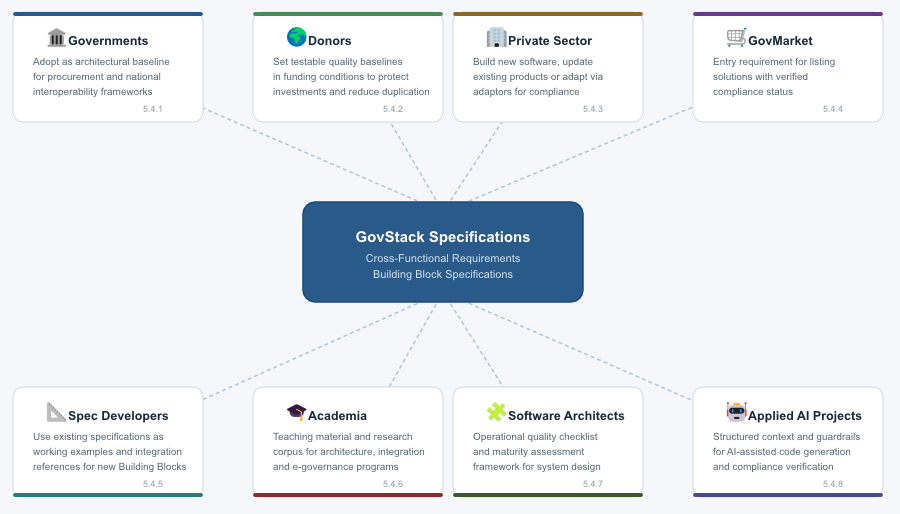

---
metaLinks:
  alternates:
    - >-
      https://app.gitbook.com/s/dU03bcgqfvodP4msaMaL/5-specification-framework/5.4-specification-use
---

# 5.5 Specification Use

GovStack specifications are designed to be adopted in different ways depending on the maturity and ownership of the software involved.

<figure><figcaption></figcaption></figure>

#### 5.5.1 By Governments for Sustainable Digital Transformations

Governments face the same technical decisions repeatedly: API design, identity across agencies, security baselines, deployment packaging, interoperability rules. Solving these independently per ministry or project leads to duplication, point-to-point dependencies and rising maintenance costs.

GovStack specifications provide a ready-made and vendor-neutral architectural baseline. Governments can adopt them selectively - a country with a mature identity system can adopt only the data exchange specification, while a country starting fresh can adopt the full cross-functional baseline. The goal is to stop reinventing infrastructure decisions and focus effort on services that matter to citizens.

**Can Be Used Within Interoperability Frameworks**

GovStack specifications can be integrated - in part or in whole - into a government's own interoperability framework and policy documents. For example, a national framework might reference GovStack cross-functional requirements as the mandatory technical baseline for software procurement or adopt specific Building Block specifications as standard interface contracts for shared services.

#### 5.5.2 By Donors to Fund Sustainable Digital Transformations

International development donors need assurance that funded solutions are interoperable, maintainable and reusable beyond the initial project. GovStack specifications give donors a concrete and testable quality baseline to include in funding conditions.

Organizations such as the World Bank, the Bill & Melinda Gates Foundation, GIZ (on behalf of BMZ), ITU, DIAL, ESTDEV, the European Commission, USAID, UNICEF and UNDP can require GovStack compliance in funding agreements to set verifiable technical requirements in terms of reference, evaluate deliverables against published specification requirements, protect investments by ensuring funded solutions can be reused or replaced in future programs and reduce duplication across programs by requiring the same specification baseline.

#### 5.5.3 By Private Sector to Build or Adjust Software Solutions

**New Software Built Against a Specification**

A new software solution can be developed from the start against a GovStack specification. This is the cleanest path because the specification informs architecture, API design and cross-functional compliance from the first commit rather than being retrofitted later.

If the solution falls within the scope of an existing Building Block specification - for example Wallet, Workflow or Information Mediator - then the team implements that specification directly. The Building Block specification inherits all cross-functional requirements from govstack-cfr, so meeting the Building Block specification means meeting the architectural baseline as well.

If no Building Block specification exists for the domain, the team can still build against govstack-cfr alone. This makes the solution compatible with the GovStack ecosystem even though no domain-specific functional specification has been published yet.

**Existing Software Updated for Compliance**

An existing software solution can be updated to meet a GovStack specification. The work typically involves aligning API contracts with the specification's functional requirements and OpenAPI definitions, adopting cross-functional requirements such as container packaging, UTF-8 encoding, TLS 1.3 transport and structured logging and producing the documentation and test evidence required for compliance verification.

This path preserves existing investment while opening the software to the GovStack ecosystem. It is the recommended approach whenever the development team controls the codebase.

**Existing Software Adapted Through an Adaptor**

When source code cannot be modified - due to vendor restrictions, contractual limitations or end-of-life status - an adaptor can be built as a separate component that maps the existing API to the GovStack specification. The adaptor translates URLs, payloads and data formats so that the combination of the original software and the adaptor together satisfies the specification contract.

The adaptor itself must comply with GovStack cross-functional requirements. Teams should treat the adaptor as a transitional measure and plan for native compliance where feasible.

#### 5.5.4 By GovStack GovMarket for Specification Compliance

GovStack specifications are the entry requirement for solutions published on GovMarket. Each listed solution is linked to a specific specification and version and its compliance status is visible to buyers.

**To appear on GovMarket, each Software Solution must 100% comply with all REQUIRED requirements of GovStack cross-functional requirements as well as the REQUIRED requirements of the Building Block specification.**&#x20;

GovMarket will use RECOMMENDED requirements to show percentage of compliance against that as well, to give further confidence of quality of the Building Block Software Solution.

#### 5.5.5 By GovStack Specification Developers

When defining a new Building Block specification, authors can study existing specifications as working examples of how to structure requirements, define API contracts, apply GovStack's classification system and handle extensibility. Existing foundational specifications - such as Information Mediator, Workflow and Identity - also serve as integration references: a new specification that depends on identity verification or cross-boundary data exchange references the existing specification rather than defining those capabilities from scratch.

#### 5.5.6 By Academia

GovStack specifications are publicly available, technically detailed and grounded in implementation constraints. University courses on software architecture, systems integration or digital government can use them to show how principles like modularity, API-first design and domain-driven decomposition translate into testable requirements. Researchers can use the versioned specification corpus for work on compliance testing, interoperability maturity models or comparative adoption studies.

#### 5.5.7 By Software Architects

The cross-functional requirements serve as a checklist of operational qualities - from transport security and container packaging to API deprecation lifecycles - that architects can adopt or adapt rather than deriving from first principles per project. The three maturity states of technical interoperability (protocol, cross-functional, whole-of-government) provide a framework for assessing where a system currently sits and what gaps need to be addressed. The specification framework itself - with its inheritance model, mutability classifiers and extensibility rules - is a useful reference for anyone managing a portfolio of interoperable components.

In short: GovStack specifications - especially the cross-functional requirements - are a great baselane for any modern digital service development, be it public sector, private sector or a hobby project.

#### 5.5.8 By Applied AI Projects

AI-assisted software development - whether through code generation, automated testing or agent-driven workflows - works better when it operates against a clear specification. GovStack specifications provide the kind of structured context that AI tools need: explicit requirements with unique identifiers, machine-readable API contracts in OpenAPI format, clear classification of what is required versus recommended and testable compliance criteria.

When an AI system generates code for a Building Block, the specification tells it what the output must look like. When it generates tests, the specification defines what pass and fail mean. When it reviews existing code, the cross-functional requirements provide the baseline to check against. Without this structure, AI-generated software may run but will not connect to the ecosystem it is meant to be part of.

For teams using AI to speed up government software delivery, GovStack specifications reduce the burden on human reviewers to catch architectural and interoperability problems. The specification acts as the guardrail that keeps generated output compatible with everything around it.
